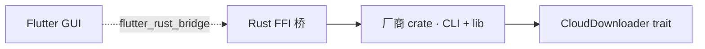

Photos Downloader 分成四层。第一期只公开本站；crate 仍为私有。

| 层 | 组件 | 角色 |
| --- | --- | --- |
| GUI | `photos_downloader_gui` | Flutter 应用，选择厂商并显示进度 |
| 共享 Dart | `photos_downloader_share` | 纯 Dart 模型 |
| FFI | `photos_downloader_bridge` | 聚合全部厂商 crate |
| 厂商 | `icloud_*` / `huawei_*` / … | 各厂商 CLI + library |
| 核心 | `photos_downloader_core` | `CloudDownloader` trait、进度与错误类型 |

HTTP 使用 `reqwest` + `rustls`，不依赖系统 OpenSSL。

公开讨论与文档 PR 请走 [photos-downloader/photos_downloader](https://github.com/photos-downloader/photos_downloader)。
