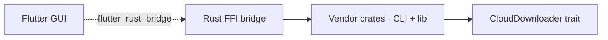

Photos Downloader has four layers. This first public release ships only the website; crates remain private.

| Layer | Component | Role |
| --- | --- | --- |
| GUI | `photos_downloader_gui` | Flutter app: pick a vendor and show progress |
| Shared Dart | `photos_downloader_share` | Pure Dart models |
| FFI | `photos_downloader_bridge` | Aggregates every vendor crate |
| Vendors | `icloud_*` / `huawei_*` / … | Per-vendor CLI + library |
| Core | `photos_downloader_core` | `CloudDownloader` trait, progress, errors |

HTTP uses `reqwest` with `rustls` (no system OpenSSL).

Public discussion and documentation PRs go to [photos-downloader/photos_downloader](https://github.com/photos-downloader/photos_downloader).
